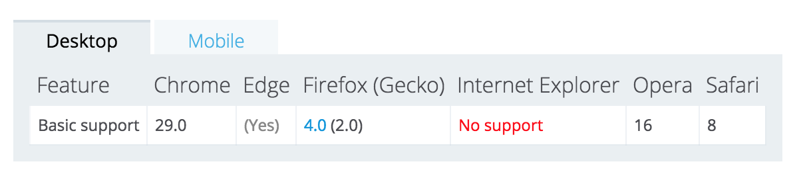
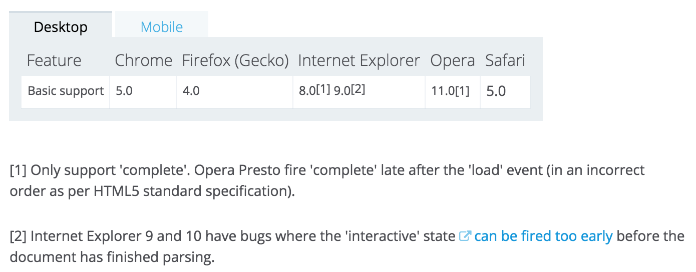

### `currentScript` 的兼容方案

在前面的 seajs 源码注释中漏掉了 `currentScript` 部分的说明，因为当时也没有看明白，现在回过头来研究这个问题。

#### 属性简介

Chrome 和 Firefox 上都提供了 `document.currentScript`，用来获取当前正在执行的 script 元素。基本在每一个前端模块加载器中都会用到这个，例如在 seajs 当中，对于 `define` 匿名模块来说，它会从 `currentScript.src` 中获取匿名模块的 uri。

但是 IE 都不支持 `document.currentScript` 属性，而我们目前基本是需要兼容 IE8 的，所以要提供兼容的方案。另外，针对低版本的 chrome、fireFox 有必要的话也需要做一些兼容性的处理。

下面提供 mdn 关于 `document.currentScript` 以及 `node.readyState` 的兼容性，下面会用到。

`document.currentScript` 兼容性：


`node.readyState`兼容性：


> 在异步代码如 `setTimeout` 等中获取 `document.currentScript` 同样是会失败的，因为异步的代码是在当前这个 `script` 代码出栈以后才执行的，这个需要注意，但是不是本文的关注点。

#### 方案一：兼容 IE 11 以下

因为在 IE 11 中去除了 `readyState` 属性，所以这个方案不能够兼容 IE 11。

```
function getCurrentScript(){
	 // 如果支持 currentScript 则直接返回
    if(document.currentScript){
        return document.currentScript.src
    }
    // 否则的话遍历所有 head 中的 script 标签
    // 根据 readyState 状态来判断哪个 script 正在执行
    var scripts = head.getElementsByTagName("script")
    for (var i = 0, script; script = scripts[i++];) {
        if (script.readyState === "interactive") {
            return script.src
        }
    }
}
```

#### 方案二：兼容 IE 11 以及旧版的 chrome、fireFox

```
function getCurrentScript() {
  	// 如果支持 currentScript 则直接返回
   	if(document.currentScript) { //firefox 4+
      	return document.currentScript.src
  	}
  	var stack, e, i, scripts;
  	// 参考 https://github.com/samyk/jiagra/blob/master/jiagra.js
  	try {
      	a.b.c(); // 强制报错,以便捕获e.stack
  	} catch(e) {
      	stack = e.stack
      	if(!stack && window.opera){
            // opera 9 没有e.stack，但有 e.Backtrace，但不能直接取得，需要对 e 对象转字符串进行抽取
            stack = (String(e).match(/of linked script \S+/g) || []).join(" ");
        }
  	}
  	if(stack) {
        // e.stack最后一行在所有支持的浏览器大致如下:
        // chrome23:
        //  at http://113.93.50.63/data.js:4:1
        // firefox17:
        //  @http://113.93.50.63/query.js:4
        // opera12:
        //  @http://113.93.50.63/data.js:4
        // IE10:
        //  at Global code (http://113.93.50.63/data.js:4:1)
        stack = stack.split( /[@ ]/g).pop(); // 取得最后一行,最后一个空格或@之后的部分
        stack = stack[0] == "(" ? stack.slice(1,-1) : stack;
        return stack.replace(/(:\d+)?:\d+$/i, ""); // 去掉行号与或许存在的出错字符起始位置
  	}
  	// 如果 a.b.c(); 奇迹般地存在没有报错，那么退回第一种方案
  	// 否则的话遍历所有 head 中的 script 标签
    // 根据 readyState 状态来判断哪个 script 正在执行
  	scripts = document.head.getElementsByTagName("script")
  	for (i = 0, script; script = scripts[i++];) {
        if (script.readyState === "interactive") {
            return script.src
        }
    }
}
```

#### 小结

上面的两个方案提供了解决这个问题的两种思路，一是利用 `script` 元素的 `readyState` 来获取，二是利用错误栈的信息来获取（十分巧妙），不过要考虑各种浏览器的错误栈的格式比较烦。

低版本的 chrome、fireFox 已经基本见不到了，如果不算 IE 11，第一种方案已经足够用了，seajs 就使用的是类似第一种的方案。

如果需要更高的鲁棒性，那么必须使用第二种思路，因为在fireFox 4-、IE 11 下是没有 `readyState` 的，所以 IE 11、fireFox 4- 只能够使用第二种方案来进行兼容。

#### 参考资料

1. [getCurrentScript的改进](http://www.cnblogs.com/rubylouvre/archive/2013/01/23/2872618.html)
2. [mdn readyState](https://developer.mozilla.org/en-US/docs/Web/API/Document/readyState)
3. [mdn currentScript](https://developer.mozilla.org/en-US/docs/Web/API/Document/currentScript)

