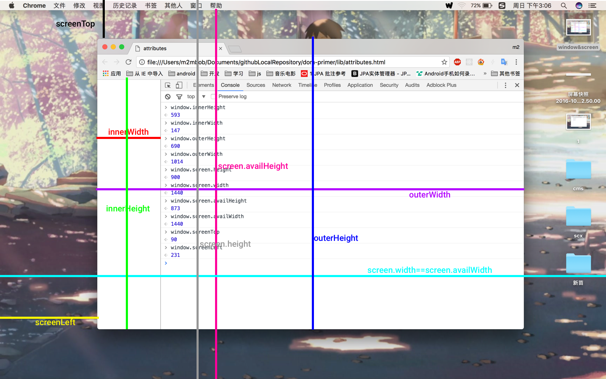

### 尺寸总结

#### `window` 和 `screen` 相关



###### `window`

- `window.innerWidth`：视口的宽。
- `window.innerHeight`：视口的高。
- `window.outerWidth`：浏览器窗口的宽。
- `window.outerHeight`：浏览器窗口的高。

> 兼容性，这四个属性在 IE9 及以上才支持。

###### `screen`

- `screen.width`：屏幕的宽。
- `screen.height`：屏幕的高。
- `screen.availWidth`：可利用的宽，等于屏幕的宽。
- `screen.availHeight`：可利用的高，等于屏幕的高减去 mac 顶部栏或 windows 底部栏。
- `screenTop`：浏览器窗口左上角到屏幕上边缘的距离。
- `screenLeft`：浏览器窗口左上角到屏幕左边缘的距离。
- `screenX`：等于 `screenLeft`。
- `screenY`：等于 `screenY`。

> 没有兼容性问题。

#### 元素相关

###### `client-*`

- `Element.prototype.clientWidth`
 - 如果元素没有设置宽：宽由内部元素决定或者块级元素的宽会占满父元素。
 - 如果有滚动条
     - `clientWidth` = 元素宽 + `padding`（左右） - 滚动条
 - 如果没有滚动条
     - `clientWidth` = 元素宽 +  `padding`（左右） 
- `Element.prototype.clientHeight`
 - 同 `clientWidth` 区别是没有设置高时仅由内部元素决定。
- `Element.prototype.clientTop`
 - 等于 `border-top`
- `Element.prototype.clientLeft`
 - 等于 `border-left`

 > 没有兼容性问题，各个浏览器表现一致。但是要注意 mac 和 windows 下滚动条策略不同，windows 下默认有滚动条，而 mac 下只有滚动时才有滚动条。

###### `offset-*`

- `HTMLElement.prototype.offsetWidth`
 - 如果元素没有设置宽：宽由内部元素决定或者块级元素的宽会占满父元素。
 - `offsetWidth` = 元素宽 + `padding`（左右）+ `border`（左右）
- `HTMLElement.prototype.offsetHeight`
 - 同 `offsetWidth` 区别是没有设置高时仅由内部元素决定。
- `HTMLElement.prototype.offsetParent`：
 - `offsetParent` 是该元素父元素中最近的定位元素。
 - 注意很多书上讲没有定位的父元素，就以 `body` 来计算，这是错误的，应该是以 `documentElement` 来计算。本质上来看 `documentElement` 也是父级元素，并没有违反上面一条规则。
- `HTMLElement.prototype.offsetTop`
 - 当前元素内容区域（包括border）顶部到 `offsetParent` 内容区域（不包括border）顶部的距离。
- `HTMLElement.prototype.offsetLeft`
 - 当前元素内容区域（包括border）左边缘到 `offsetParent` 内容区域（不包括border）左边缘的距离。

 > `offsetWidth` 和 `offsetHeight` 基本没有什么兼容性问题，而 `offsetTop` 和 `offsetLeft` 在不同浏览器下的表现不太一样。但是测试了新的 chrome、fireFox 是一样的，都是上面所说的规则。

###### `scroll-*` 

- `Element.prototype.scrollWidth`
 - 如果元素没有设置宽：宽由内部元素决定或者块级元素的宽会占满父元素。
 - 内容区域小于元素的宽高时，等于 `clientWidth`。
 - 内容区域大于元素的宽高时，等于实际内容的宽度 + padding（两部分）。
- `Element.prototype.scrollHeight`
- `Element.prototype.scrollTop`
 - 可读写
- `Element.prototype.scrollLeft`
 - 可读写

###### 两个特殊的元素 `docmuentElement` 和 `body`

- `document.documentElement.clientWidth` 始终为视口的宽。
- `document.documentElement.clientHeight` 始终为视口的高。
- `document.documentElement.offsetWidth` 始终为视口的宽度。
- `document.documentElement.offsetHeight` 高度由内部元素撑起。
- `document.body.clientWidth` 没有宽则根据 `documentElement` 减去 `margin` 和 `border` 计算，有宽则直接拿来计算。
- `document.body.clientHeight` 没有宽则根据内部元素撑起的高度进行计算，有高则直接拿来计算。
- `document.body.offsetWidth` 没有宽则根据 `documentElement` 减去 `margin` 计算，有宽则直接拿来计算。
- `document.body.offsetHeight` 没有宽则根据内部元素撑起的高度进行计算，有高则直接拿来计算。
- `document.body.scrollWidth`
- `document.body.scrollHeight`

规则：（注意下面的规则对于的宽高是独立的）

1. 当给定的宽高小于视口的宽高则返回的是视口的宽高。（fireFox 下直接进入 2、3 两个判断）
2. 当给定的宽高大于视口的宽高，并且内容区域小于给定的宽高，也就是没有滚动条出现，则返回的是给定的宽高加上对应的 margin、padding、border。
3. 当给定的宽高大于视口的宽高，并且内容区域大于给定的宽高，也就是有滚动条出现，则返回的是内容区域的宽高加上对应的 margin、padding、border。

- `document.documentElement.scrollWidth`
- `document.documentElement.scrollHeight`

规则：

1. 当 body 的 `scrollHeight` 小于视口的高则返回的是视口的高。
2. 当 body 的 `scrollHeight` 大于视口的高则返回的是 body 的 `scrollHeight`。
3. 宽的话始终等于视口的宽。

> 在 fireFox 和 chrome 表现不一致，上面写到的都是 chrome 中的规则。

###### 获取视口大小的兼容性写法

本来按上面写的 `document.documentElement.clientWidth` 才是正确的，这么做主要是为了兼容低版本浏览器或者没有加 `doctype` 的一些情况：

```
let w = document.documentElement.clientWidth || document.body.clientWidth
let h = document.documentElement.clientHeight || document.body.clientHeight
```

#### `Event` 的五个坐标

- `clientX`、`clientY` 相对于视口。
- `screenX`、`screenY` 相对于屏幕。
- `offsetX`、`offsetY` 相对于事件源。
- `pageX`、`pageY` 相对于页面。
- `X`、`Y` 相对于 Css 动态定位最内层的包容元素。（chrome 中等于 `clientX`、`clientY`，IE 下默认等于  `clientX`、`clientY`，但是设置了 `position` 则和 `offsetX`、`offsetY` 相等）


